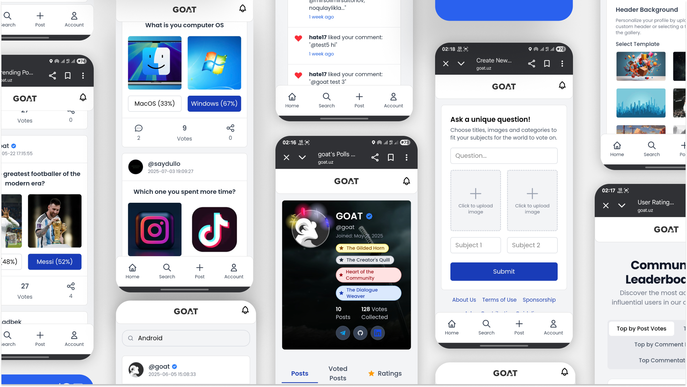

# GOAT: Social Debate Platform



[GOAT](https://www.goat.uz) is a sophisticated social debate application engineered with the Laravel 12 framework. It is designed to provide a feature-rich, scalable, and secure environment for user-driven discussions. The platform's architecture leverages modern design patterns and integrates several advanced technologies, including artificial intelligence for content moderation and real-time 3D graphics for user engagement.

---

## Core Architectural Features

The platform is built with a focus on performance, security, and a rich user experience.

* **Content Moderation Pipeline**: Integrates **Google's Gemini Pro API** for real-time analysis and moderation of all user-generated content, including text (posts, comments), images, and external URLs, augmented by a local, configurable keyword-based filter.

* **Asset Generation**: Leverages **Stable Diffusion AI** to empower users to generate unique profile picture assets directly from text-based prompts.

* **Real-Time 3D Rendering Engine**: Utilizes a **Three.js/WebGL** engine running in a dedicated **Web Worker** to render complex, interactive 3D user achievement badges. This offloads heavy rendering from the main thread, ensuring a smooth and responsive UI.

* **WebAssembly (WASM) Module Integration**: Employs C++ modules compiled to WebAssembly via Emscripten for performance-critical, computationally intensive geometry calculations used in the 3D rendering engine.

* **Secure Authentication & Authorization**: Implements a robust authentication system supporting both local credentials and **Google OAuth2**. The application is hardened with a strict Content Security Policy (CSP), security headers, and follows best practices for user data protection.

* **Automated Email Notifications**: A scheduled, queue-based system that notifies users of new posts. The system is intelligent, only sending digests when there is sufficient new content since the user's last notification, and respects user-configurable preferences to opt-in or opt-out.

* **Advanced Search & Discovery**: Features a sophisticated search system powered by **Levenshtein distance** and **Soundex phonetic algorithms** to deliver accurate "fuzzy" search results for both content and users.

* **System Administration & Maintenance Subsystem**: Includes a suite of powerful custom Artisan commands for database cleanup, sitemap generation, image optimization, and an advanced, filterable command-line log viewer.

* **Automated Image Processing Pipeline**: All user-uploaded image assets are automatically processed, optimized, and converted to the next-generation **WebP** format to reduce bandwidth and improve load times.

* **Search Engine Optimization & Internationalization (i18n)**: Features automated sitemap generation with ping submissions to Google and Bing to ensure optimal indexing. The platform is fully internationalized with support for multiple locales.

---

## Technology Stack

The project is implemented using a curated selection of modern and powerful technologies.

* **Backend**: PHP 8.3+, Laravel 12, MySQL
* **Frontend**: JavaScript (ESM), Three.js (WebGL), GLSL, Tailwind CSS, Vite
* **High-Performance Computing**: C++ compiled to WebAssembly (WASM) via Emscripten
* **Core APIs**: Google Gemini API, Stable Diffusion, Google OAuth 2.0

---

## Local Development Environment Setup

### Prerequisites

* PHP >= 8.3
* Composer
* Node.js & npm
* MySQL (or a compatible database)
* **Emscripten SDK**: Required for compiling the C++ to WASM module. See the [official documentation](https://emscripten.org/docs/getting_started/downloads.html) for installation.

### Installation Steps

1.  **Clone the repository:**
    ```sh
    git clone https://github.com/umaarov/goat-dev.git
    cd goat-dev
    ```

2.  **Install backend dependencies:**
    ```sh
    composer install
    ```

3.  **Install frontend dependencies:**
    ```sh
    npm install
    ```

4.  **Configure the Environment:**
    * Create the environment configuration file:
        ```sh
        cp .env.example .env
        ```
    * Generate a unique application key:
        ```sh
        php artisan key:generate
        ```
    * Populate the `.env` file with your database credentials, API keys, and other required values. Refer to the table below.

5.  **Database Migration:**
    ```sh
    php artisan migrate
    ```

6.  **Compile the WebAssembly Module:**
    * Ensure the Emscripten SDK environment is active in your terminal.
    * Execute the compilation script:
        ```sh
        bash build.sh
        ```
    * This generates `geometry_optimizer.js` and `geometry_optimizer.wasm` in `public/assets/wasm/`.

7.  **Build Frontend Assets:**
    ```sh
    npm run build
    ```

8.  **Run Local Servers:**
    * Start the PHP development server:
        ```sh
        php artisan serve
        ```
    * In a separate terminal, start the Vite HMR server:
        ```sh
        npm run dev
        ```

9.  **Configure Task Scheduler:**
    * For scheduled tasks to function correctly in a production environment, add the following Cron entry to your server:
        ```sh
        * * * * * cd /your-project-folder && php artisan schedule:run >> /dev/null 2>&1
        ```

---

## Environment Configuration

The following `.env` variables are critical for full application functionality.

| Variable                | Description                                                   |
|-------------------------|---------------------------------------------------------------|
| `DB_CONNECTION`         | The database driver (e.g., `mysql`).                          |
| `DB_HOST`               | The database host.                                            |
| `DB_PORT`               | The database port.                                            |
| `DB_DATABASE`           | The database schema name.                                     |
| `DB_USERNAME`           | The database user.                                            |
| `DB_PASSWORD`           | The database user's password.                                 |
| `GOOGLE_CLIENT_ID`      | The OAuth Client ID from your Google Cloud project.           |
| `GOOGLE_CLIENT_SECRET`  | The OAuth Client Secret from your Google Cloud project.       |
| `GOOGLE_REDIRECT_URI`   | The configured OAuth redirect URI.                            |
| `GEMINI_API_KEY`        | Your API key for the Google Gemini AI service.                |
| `CLOUDFLARE_ACCOUNT_ID` | Your Cloudflare Account ID for AI services.                   |
| `CLOUDFLARE_API_TOKEN`  | A Cloudflare API Token with AI permissions.                   |
| `CLOUDFLARE_AI_MODEL`   | The specific Cloudflare AI model to use for image generation. |
| `MAIL_MAILER`           | The mail driver (e.g., `smtp`).                               |
| `MAIL_HOST`             | The SMTP server host.                                         |
| `MAIL_USERNAME`         | The SMTP username for authentication.                         |
| `MAIL_PASSWORD`         | The SMTP password for authentication.                         |

---

## Command-Line Interface (CLI)

The application provides a set of custom Artisan commands for system maintenance and administration.

* `users:cleanup-unverified`
    * **Description**: Deletes user accounts that have not been verified via email within the configured timeframe (default: 1 hour).
    * **Usage**: `php artisan users:cleanup-unverified`
    * **Schedule**: Executes every ten minutes.

* `sitemap:generate`
    * **Description**: Generates a new `sitemap.xml` file containing all application routes accessible to search engines.
    * **Usage**: `php artisan sitemap:generate`
    * **Schedule**: Executes daily at 02:00.

* `images:optimize`
    * **Description**: A batch-processing command that finds and converts all existing JPEG/PNG images for posts and profiles to the high-efficiency WebP format.
    * **Usage**: `php artisan images:optimize`

* `app:show-logs`
    * **Description**: An advanced, interactive log viewer for the terminal.
    * **Usage**: `php artisan app:show-logs [options]`
    * **Options**:
        * `--lines`: Number of lines to show.
        * `--channel`: Specify the log channel (e.g., `laravel`, `audit_trail`).
        * `--date`: View logs for a specific date (YYYY-MM-DD).
        * `--grep`: Filter lines containing a specific string (case-insensitive).
        * `--tail`: Continuously tail the log file for real-time monitoring.

---

## Contribution

We welcome contributions to enhance the platform. Please adhere to the following process for submitting changes.

1.  Fork the repository.
2.  Create a new feature branch (`git checkout -b feature/YourFeature`).
3.  Commit your changes with clear, descriptive messages (`git commit -m 'feat: Implement YourFeature'`).
4.  Push the branch to your fork (`git push origin feature/YourFeature`).
5.  Open a pull request for review.

---

## License

This project is open-source software licensed under the [MIT License](https://opensource.org/licenses/MIT).
