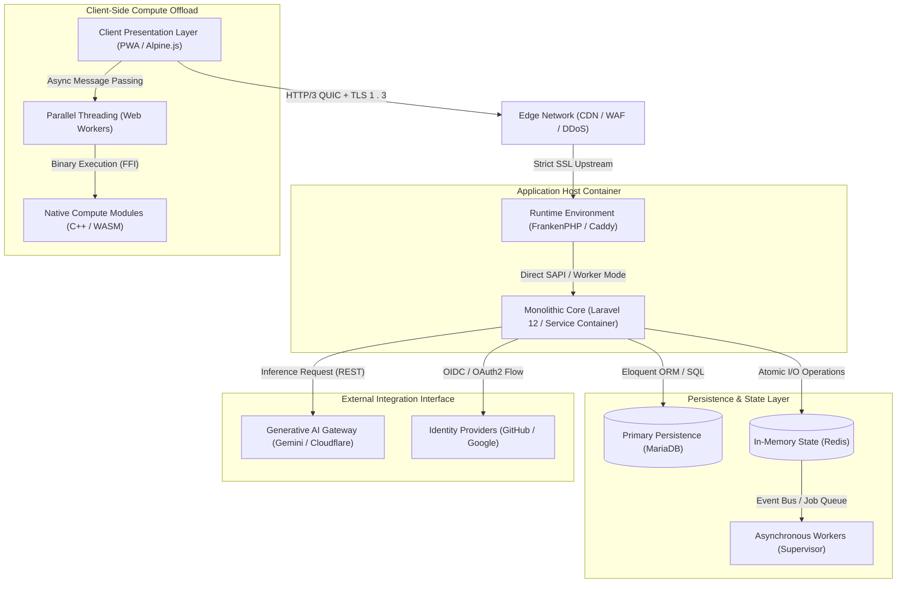

# GOAT - Social Debate Platform


<div align="center">

[](LICENSE)
[](https://php.net/)
[](https://laravel.com)
[](https://frankenphp.dev/)
[]()

*

*[Live Demo](https://www.goat.uz) • [Documentation](docs/goat_doc_en.pdf) • [Report Bug](https://github.com/umaarov/goat-dev/issues)
**

</div>

---

## 📖 Introduction

**GOAT** is a mission-critical, open-source social platform engineered from the ground up for structured, high-quality
debate. Unlike traditional social media, it focuses on intelligent discourse, utilizing a hybrid architecture to solve
common problems like low-quality content and ineffective discovery.

Under the hood, GOAT is a high-performance monolith built on **Laravel 12** and **FrankenPHP**, utilizing **HTTP/3** for
speed. It features a rich frontend with **Alpine.js** and **Three.js**, where computationally expensive tasks (like 3D
rendering) are offloaded to **Web Workers** and **WebAssembly (C/C++)** modules to ensure a fluid 60fps experience.

---

## 🚀 Key Features & Technical Highlights

### Core Platform

* **Hybrid Search Engine:** A sophisticated search system combining **BM25**, **Vector Similarity**, **Levenshtein
  distance**, and **Soundex** to understand user intent and deliver accurate results.
* **Structured Debates:** Asynchronous, text-based debate system with nested arguments and rate-limited voting to ensure
  fair participation.
* **Gamification:** Unique interactive 3D achievement badges rendered in real-time via WebGL/Three.js.

### 🤖 AI Integration

* **Content Moderation:** Powered by **Google Gemini Pro**. Automatically detects spam, toxicity, and low-effort
  content.
* **Generative Assets:** Users can generate custom profile pictures using text prompts via **Stable Diffusion** (powered
  by Cloudflare AI Workers).
* **Smart Insights:** AI-generated summaries and context for complex debate threads.

### ⚡ Performance Engineering

* **FrankenPHP & HTTP/3:** Runs as a persistent application server using Caddy with FrankenPHP for high-throughput and
  native HTTP/3 support.
* **WASM & C++:** Performance-critical geometry calculations for the 3D engine are handled by **C/C++ modules compiled
  to WebAssembly**.
* **Edge Security:** Integrated with Cloudflare for DDoS mitigation, WAF, and global CDN asset caching.
* **PWA Ready:** Fully installable Progressive Web App for a seamless desktop and mobile experience.

---

## 🛠️ Technology Stack

| Domain          | Technologies                                              |
|:----------------|:----------------------------------------------------------|
| **Backend**     | PHP 8.3+, Laravel 12, MariaDB, Redis, FrankenPHP (Caddy)  |
| **Frontend**    | Alpine.js, Tailwind CSS, Three.js, Blade Templates, Vite  |
| **System**      | Docker, Supervisor, WebAssembly (Emscripten), C/C++, GLSL |
| **AI Services** | Google Gemini API, Stable Diffusion (Cloudflare Workers)  |
| **Realtime**    | Pusher (WebSockets), Laravel Echo                         |

---

## 🧩 System Architecture



## ⚡ Getting Started

### Prerequisites

* **Docker & Docker Compose** (Recommended)
* **Node.js** & **NPM**
* **Emscripten SDK** (Only required if re-compiling C++ WASM modules)

### Installation (Docker)

1. **Clone the repository**
   ```bash
   git clone [https://github.com/umaarov/goat-dev.git](https://github.com/umaarov/goat-dev.git)
   cd goat-dev
   ```

2. **Configure Environment**
   ```bash
   cp .env.example .env
   ```
   *Update `.env` with your database credentials and API keys (Google, Cloudflare, etc).*

3. **Start Application**
   ```bash
   docker-compose up -d --build
   ```

4. **Install Dependencies & Setup**
   ```bash
   # Install PHP dependencies
   docker-compose exec app composer install

   # Generate Key & Migrate
   docker-compose exec app php artisan key:generate
   docker-compose exec app php artisan migrate --seed

   # Install Node dependencies
   docker-compose exec app npm install
   ```

5. **Compile Assets & WASM**
   ```bash
   # Build Frontend
   docker-compose exec app npm run build

   # Compile C++ to WASM (requires Emscripten environment)
   # Ensure source variables are set if running manually
   docker-compose exec app bash build.sh
   ```

6. **Access the App**
    * Open `http://localhost:8000` (or your configured port).

---

## ⚙️ Environment Configuration

The application relies on several external services. Ensure these are set in your `.env` file:

| Variable               | Description                                          |
|:-----------------------|:-----------------------------------------------------|
| `GEMINI_API_KEY`       | Required for AI moderation and chat features.        |
| `CLOUDFLARE_API_TOKEN` | Required for AI image generation (Stable Diffusion). |
| `GOOGLE_CLIENT_ID`     | OAuth Client ID for Google Login.                    |
| `PUSHER_APP_KEY`       | Required for real-time notifications/broadcasting.   |

*See `.env.example` for the full list of available variables.*

---

## 💻 Artisan Command Suite

The project includes custom commands for maintenance and administration:

* `php artisan users:cleanup-unverified` - Removes stale user accounts.
* `php artisan sitemap:generate` - Rebuilds SEO sitemaps and pings search engines.
* `php artisan images:optimize` - Converts uploaded assets to WebP.
* `php artisan app:netdebug` - Diagnoses connectivity to external APIs.

---

## 📚 Documentation

Detailed documentation is available in the `docs/` directory:

* [**Project Documentation**](docs/goat_doc_en.pdf) - Full system overview and specs.
* [**UI/UX Design**](docs/goat_ui.pdf) - Visual mockups and flow.
* [**Database Schema**](docs/goat_db.pdf) - ER diagrams and table structures.

---

## 🤝 Contributing

We welcome contributions! Please see our [Contributing Guidelines](CONTRIBUTING.md) for details.

1. Fork the project
2. Create your feature branch (`git checkout -b feature/AmazingFeature`)
3. Commit your changes (`git commit -m 'Add some AmazingFeature'`)
4. Push to the branch (`git push origin feature/AmazingFeature`)
5. Open a Pull Request

## 📄 License

Distributed under the **MIT License**. See `LICENSE` for more information.

## 🌟 Support

If you find this project useful, please give it a Star! ⭐

---
*Lead Developer: [Ismoiljon Umarov](https://linkedin.com/in/umaarov)*
